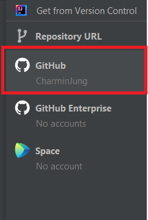

# Cloning a GitHub project to your IDE

## Overview

This part of the guide will walk you through how to clone an existing GitHub project into your IDE. This will give you the opportunity to ensure that your IDE projects are connected and saved in one spot. To follow the steps in this guide you will need a GitHub account to be linked to your JetBrains IDE.  

### Goals

By the end of this guide you will have cloned an Existing Github Project into your IDE. This skill works with any existing github projects which is necessary.

### &emsp; Prerequisites

Prior to connecting your account to your JetBrains IDE you will need:  

* **A GitHub account**
* **A JetBrains IDE (Intellij, CLion, Pycharm, etc.)**
* **Your GitHub account to be connected to your JetBrains IDE**

## Cloning a Project into IDE

1. ℹ️  Click on the VCS button on the top menu

    

    ✅ A menu should now appear providing you a list of option

    

2. ℹ️  Click on the Get from Version Control option on the menu

    

    ✅ A new window should now appear. Here you have the ability to access Repository URL, GitHub, GitHub Enterprise and Space. We want to access Github

    

3. ℹ️  Click on the Github button on the side menu

    

    ✅ A list of existing and new projects should appear. This is a collection of all your remote repositories on Github.

    

4. ℹ️  Click on any of the existing projects that is displayed in the list of projects

    

    !!! alert
        &emsp;**If you cannot see any projects avaible then you have to log in and follow step 5 under the Title "Connect IDE to GitHub account".**

         

        Direct to (Connecting to GitHub.md) for more help

    ✅ Now you have the repo selected, you need to clone it to completely access it on your IDE

5. ℹ️  Click on the Clone button (bottom right corner)

    

    ✅ Now another new window will appear to ask you to trust the file. We want to completely clone it on your IDE.

    

6. Click on Trust Project to proceed

    

    ✅ Now the final window will appear giving you three options. They are "This Window", "New Window" and "Cancel".

    

7. Click on the button, "This Window" or "New Window" to completely clone your project into your IDE

    

    ✅Now you have completed the process of cloning your project into your IDE.

    

    👍 Congratulations! You just cloned a project and now you have the skills to do it in the future!
